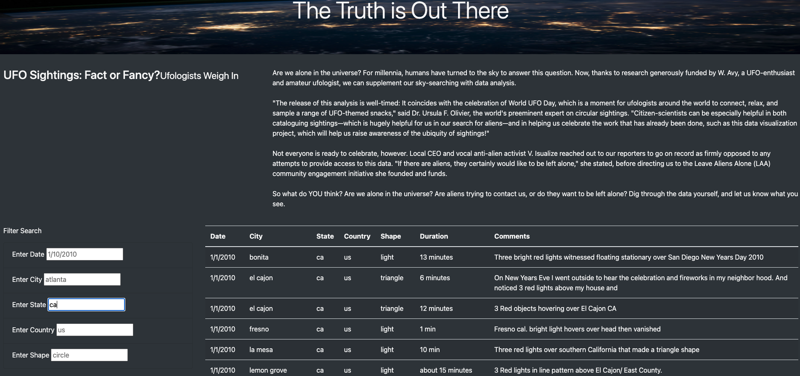
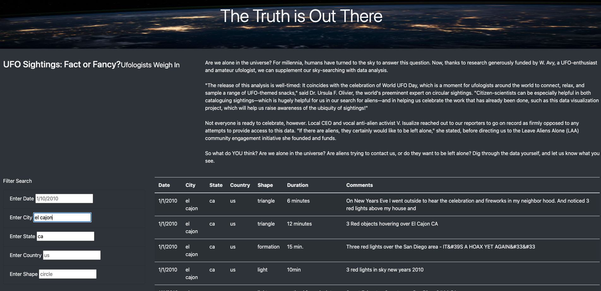
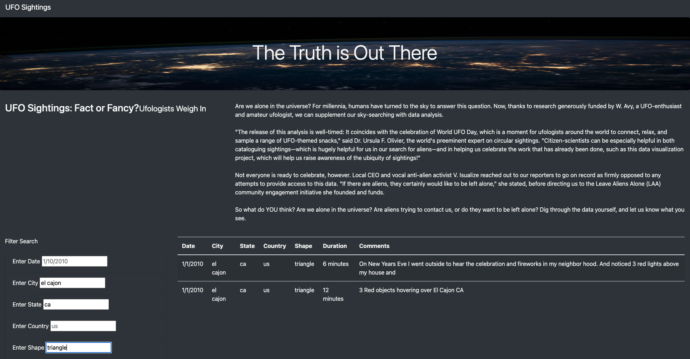

# UFO Finder

## Overview

The UFO finder HTML was built to catalog UFO sightings throughout the country.  UFO enthusiasts can visit the website once launched and see data about UFO sightings, including the city and state where the UFO was sighted, the shape of the UFO and the date the UFO was sighted.  

## Resources

### Software
- Visual Studio Code
- Bootstrap

### Data
- data.js

## Results
Users will log onto the UFO Finder and select 1 or more out of 5 search criteria:
- City
- State
- Country
- Shape
- Date

Based on the criteria the user wants to search by, they will enter this into the appropriate search field on the left side of the page and press enter.  The table seen in the middle of the page will filter the data based on search criteria and return a table that only lists data that matches the user's entry.

### Example 1:

Suppose our user is a California native and wants to see how many UFOs have been sighted throughout the state.  The user would start with typing in the state abbreviations, in lower-case, into the 'Enter State' field on the page.  In this case, the abbreviation for California is 'ca', thus we will enter this into the state field (in lower-case).  The UFO Finder will then return a table that only includes results from California.

### Example 2:
Our user is from El Cajon and is curious as to how many sightings have been seen in this area.  Our user has two options:  either further filter the list by typing in 'el cajon' while 'ca' remains a filter, or remove the 'ca' and simply type in 'el cajon'.  Our user elects to further filter by typing in 'el cajon', in lower-case,  into the 'Enter City' field.  The UFO Finder will return a table that only includes results that are in the city of El Cajon and in the state of California.

### Example 3:
Our user remembers seeing some strange aircraft one night in 2010 and is curious if others may have reported this strange sighting.  Our user doesn't remember much, but remembers the shape of the aircraft, it was a triangle!  Our user further filters the search and types in 'triangle' into the 'Enter Shape' field. The UFO Finder will return a table that only includes results that are in the city of El Cajon, in the state of California, that have a shape of triangle.  Our user remembers the sighting occurred in the summer, thus the results did not match the sighting.  However, our user can use the same technique in the future, in case some does remember that particular sighting.  Maybe our user can even submit the sighting to be included.

## Summary

The search criteria cannot be performed on the duration field, although this remains important data that a user might want to see.  The webpage also does not accept any updated data, so the data here is very static.

 ### Recommendations
 
 - For future analysis, it may be helpful to scrape data from the web that is updated and will provide the most recent UFO sightings as opposed to a log of data that does not change.  I imagine users will want to see the most recent UFO sightings in real time.  Building a function that will update the data will allow for this to happen.
 - It would also be helpful to expand the dataset to include more data from other countries.  Most of the data provided is from the United States, with few exceptions.  Gathering data from other countries would help expand the data pool for UFO sightings.  

